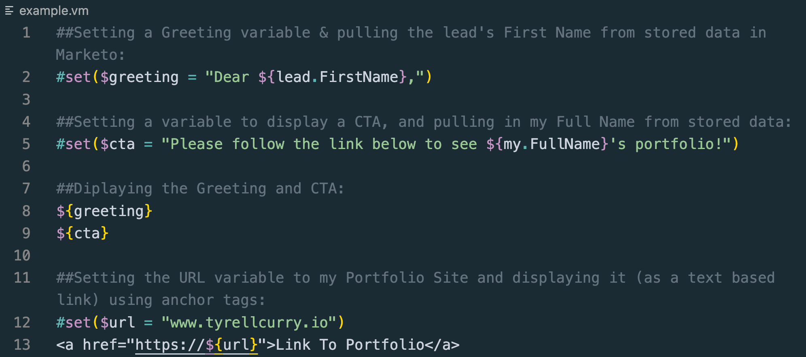

# Velocity Script Example

## Here is a simple Velocity Email Script that greets the customer, prompts them with a call to action, and provides a clickable link utilizing `html`, `stored data`, and `variables`:

 

 

## Here is an example of the output from this Script:

### Dear Simon,

### Please follow the link below to see Tyrell Curry's portfolio!

### <a href="https://www.tyrellcurry.io">Link to Portfolio</a>

## Thanks for checking it out 👋!
